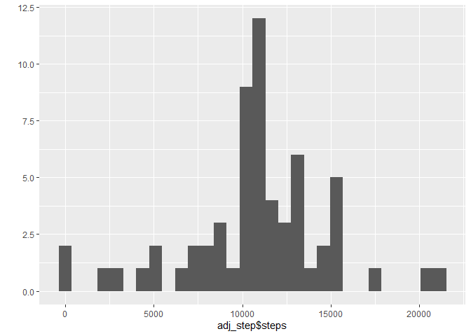

## Loading and preprocessing the data
1. Load the data

```r
library(utils)
activity<-read.csv("activity.csv")
```
2. Transform the data

```r
activity$date<-as.Date(activity$date, format="%Y-%m-%d")
```


## What is mean total number of steps taken per day?
1. Calculate the total number of steps taken per day

```r
library(dplyr)
```

```
## Warning: package 'dplyr' was built under R version 4.0.3
```

```
## 
## Attaching package: 'dplyr'
```

```
## The following objects are masked from 'package:stats':
## 
##     filter, lag
```

```
## The following objects are masked from 'package:base':
## 
##     intersect, setdiff, setequal, union
```

```r
act_step<-activity%>%select (steps, date) %>% filter(!is.na(steps)) %>% group_by(date) %>% summarize_if(is.numeric, sum)
```

2. Make a histogram of the total number of steps taken each day

```r
library(ggplot2)
```

```
## Warning: package 'ggplot2' was built under R version 4.0.3
```

```r
qplot(act_step$steps, geom="histogram")
```

```
## `stat_bin()` using `bins = 30`. Pick better value with `binwidth`.
```

<!-- -->


3. Calculate and report the mean and median of the total number of steps taken per day

```r
original_mean<-mean(act_step$steps)
print(paste("The mean is", original_mean))
```

```
## [1] "The mean is 10766.1886792453"
```

```r
original_median<-median(act_step$steps)
print(paste("The median is", original_median))
```

```
## [1] "The median is 10765"
```


## What is the average daily activity pattern?
1. Make a time series plot of the 5-minute interval (x-axis) and the average number of steps taken, averaged across all days (y-axis)

```r
intervalpatt<-activity%>%select (steps, interval) %>% filter(!is.na(steps)) %>% group_by(interval) %>% summarize_if(is.numeric, mean)
plot(intervalpatt$interval, intervalpatt$steps, type="l")
```

<!-- -->

2. Which 5-minute interval, on average across all the days in the dataset, contains the maximum number of steps?

```r
maxint<-intervalpatt$interval[intervalpatt$steps==max(intervalpatt$steps)]
print(paste("The interval with the maximum number of steps is", maxint ))
```

```
## [1] "The interval with the maximum number of steps is 835"
```

## Imputing missing values
1. Calculate and report the total number of missing values in the dataset

```r
missval<-sum(is.na(activity$steps))
print(paste("The total number of missing values is", missval))
```

```
## [1] "The total number of missing values is 2304"
```

2. Devise a strategy for filling in all of the missing values in the dataset (Applying mean for 5min-interval)

```r
adjustedact<-activity
for(i in 1:17568){
  if(is.na(adjustedact$steps[i]))
    adjustedact$steps[i]<-intervalpatt$steps[intervalpatt$interval==adjustedact$interval[i]]
}
```
3. Create a new dataset that is equal to the original dataset but with the missing data filled in.
Checking the NA values

```r
adjNA<-sum(is.na(adjustedact$steps))
print(paste("The missing values in the adjusted data set is", adjNA))
```

```
## [1] "The missing values in the adjusted data set is 0"
```

4. Make a histogram of the total number of steps taken each day.  

```r
adj_step<-adjustedact%>%select (steps, date) %>% filter(!is.na(steps)) %>% group_by(date) %>% summarize_if(is.numeric, sum)
qplot(adj_step$steps, geom="histogram")
```

```
## `stat_bin()` using `bins = 30`. Pick better value with `binwidth`.
```

<!-- -->

Calculate and report the mean and median total number of steps taken per day

```r
adjusted_mean<-mean(adj_step$steps)
print(paste("The adjusted mean is", adjusted_mean))
```

```
## [1] "The adjusted mean is 10766.1886792453"
```

```r
adjusted_median<-median(adj_step$steps)
print(paste("The adjusted median is", adjusted_median))
```

```
## [1] "The adjusted median is 10766.1886792453"
```

Do these values differ from the estimates from the first part of the assignment?

```r
diff_mean<-original_mean-adjusted_mean
print(paste("The difference between original and adjusted mean is", diff_mean))
```

```
## [1] "The difference between original and adjusted mean is 0"
```

```r
diff_median<-original_median-adjusted_median
print(paste("The difference between original and adjusted median is", diff_median))
```

```
## [1] "The difference between original and adjusted median is -1.1886792452824"
```

What is the impact of imputing missing data on the estimates of the total daily number of steps?

There's no difference among mean, however the median change due to the dataset has more values.

## Are there differences in activity patterns between weekdays and weekends?
1. Create a new factor variable in the dataset with two levels – “weekday” and “weekend” indicating whether a given date is a weekday or weekend day

```r
activity$day<-weekdays(activity$date, abbreviate = T)
activity$day<-gsub("Mon|Tue|Wed|Thu|Fri","weekday", activity$day)
activity$day<-gsub("Sat|Sun","weekend", activity$day)
```
2. Make a panel plot containing a time series plot of the 5-minute interval (x-axis) and the average number of steps taken, averaged across all weekday days or weekend days

```r
weekpatt<-activity%>%select (steps, interval, day) %>% filter(!is.na(steps)) %>% filter(!is.na(steps)) %>% group_by(interval, day) %>% summarize_if(is.numeric, mean)
qplot(interval, steps, data=weekpatt, facets=.~day, geom=c("line"))
```

<!-- -->

Weekdays have a peak arround 7:30 to 10:00 while weekends have aroung 150 steps frome 7:30 to 17:50.  The data could explain the commuting (peak), staying at job (until 17:50), and the return to homes during weekdays.  In weekdays, the steps are distributed among all day.
